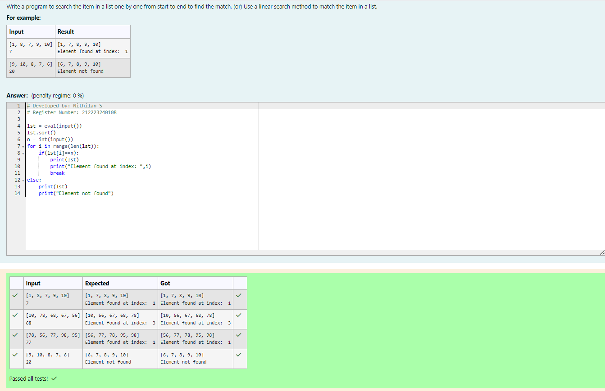
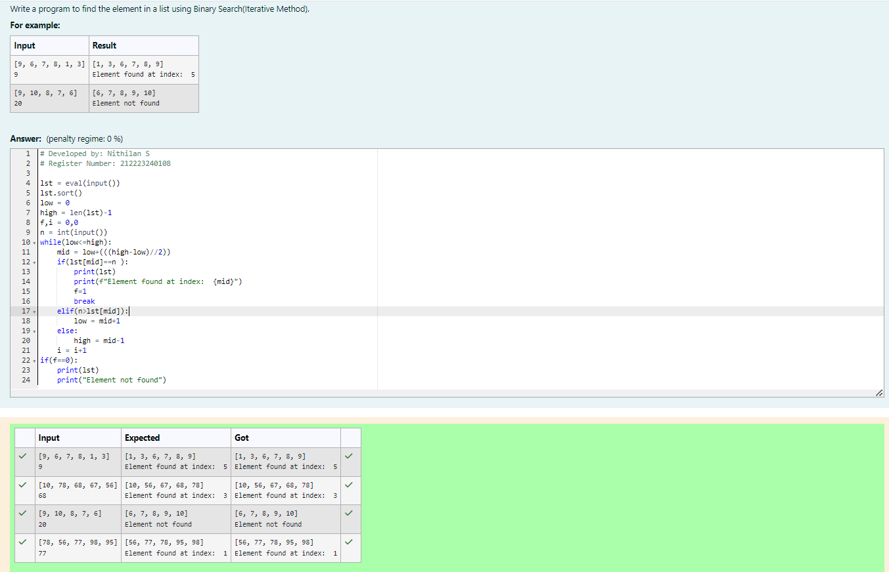
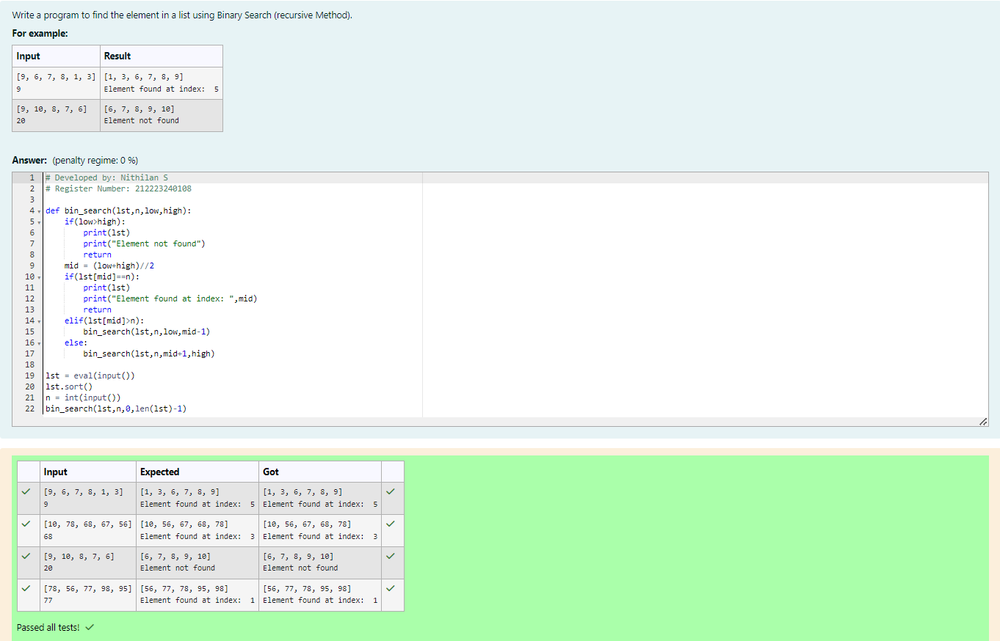

# Linear Search and Binary search
## Aim:
To write a program to perform linear search and binary search using python programming.
## Equipment’s required:
1.	Hardware – PCs
2.	Anaconda – Python 3.7 Installation / Moodle-Code Runner
## Algorithm:
## Linear Search:
1.	Start from the leftmost element of array[] and compare k with each element of array[] one by one.
2.	If k matches with an element in array[] , return the index.
3.	If k doesn’t match with any of elements in array[], return -1 or element not found.
## Binary Search:
1.	Set two pointers low and high at the lowest and the highest positions respectively.
2.	Find the middle element mid of the array ie. arr[(low + high)/2]
3.	If x == mid, then return mid.Else, compare the element to be searched with m.
4.	If x > mid, compare x with the middle element of the elements on the right side of mid. This is done by setting low to low = mid +1.
5.	Else, compare x with the middle element of the elements on the left side of mid. This is done by setting high to high = mid - 1.
6.	Repeat steps 2 to 5 until low meets high
## Program:
i)	#Use a linear search method to match the item in a list.
```python
lst = eval(input())
lst.sort()
n = int(input())
for i in range(len(lst)):
    if(lst[i]==n):
        print(lst)
        print("Element found at index: ",i)
        break
else:       
    print(lst)
    print("Element not found")

```
ii)	# Find the element in a list using Binary Search(Iterative Method).
```python
lst = eval(input())
lst.sort()
low = 0
high = len(lst)-1
f,i = 0,0
n = int(input())
while(low<=high):
    mid = low+(((high-low)//2))
    if(lst[mid]==n ):
        print(lst)
        print(f"Element found at index:  {mid}")
        f=1
        break
    elif(n>lst[mid]):
        low = mid+1
    else:
        high = mid-1
    i = i+1
if(f==0):
    print(lst)
    print("Element not found")
```
iii)	# Find the element in a list using Binary Search (recursive Method).
```python
def bin_search(lst,n,low,high):
    if(low>high):
        print(lst)
        print("Element not found")
        return 
    mid = (low+high)//2
    if(lst[mid]==n):
        print(lst)
        print("Element found at index: ",mid)
        return
    elif(lst[mid]>n):
        bin_search(lst,n,low,mid-1)
    else:
        bin_search(lst,n,mid+1,high)
    
lst = eval(input())
lst.sort()
n = int(input())
bin_search(lst,n,0,len(lst)-1)
```
## Output:




## Result:
Thus the linear search and binary search algorithm is implemented using python programming.
